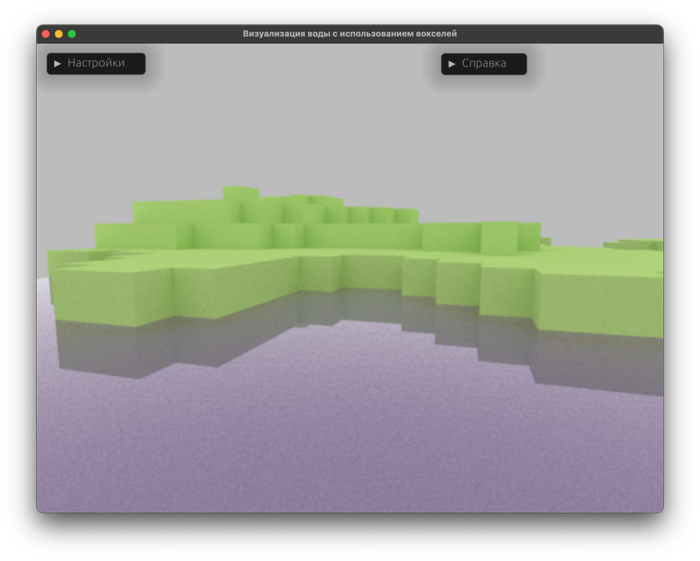
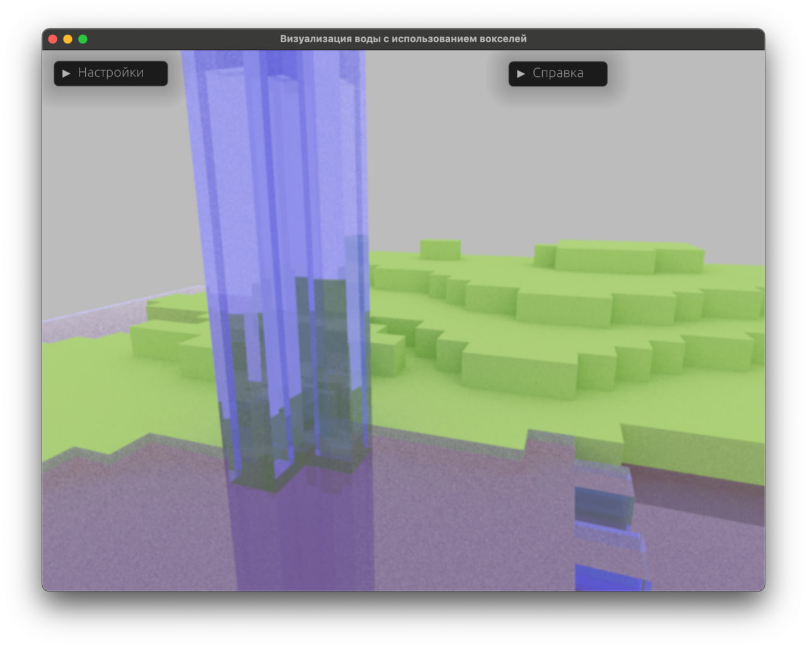

# voxel-water 

> If for sure needs better name...

## Playground 

Web versions:

* [EN](https://holodome.github.io/voxel-water/)
* [RU](https://holodome.github.io/voxel-water/)

> There are problems with running WASM code on certain systems. 
> All Apple devices (including phones) are tested and should work.

## About 

This is real-time ray tracing app with water simulation capabilities.

It uses [WGPU](https://github.com/gfx-rs/wgpu) to be able to compile to Webassembly. Theoretically, this makes it cross platform. However, Webassembly support across browsers and systems leaves much to be desired.

This app was build as course project, and you may find explanatory node (in russian) in docs directory.

Main algorithms used: 
* Naive Monte-carlo ray tracing
* [Reverse reprojection caching](https://gfx.cs.princeton.edu/gfx/pubs/Nehab_2007_ARS/NehEtAl07.pdf)
* Gaussian blur
* [Fast voxel traversal algorithm](http://www.cse.yorku.ca/~amana/research/grid.pdf)

## Screenshots




## Building and running

For local build, simply run 
```shell
cargo run
```

> There is a problem with `ahash` crate, which refuses to compile on some versions of Rust on M1. 
> `1.70-aarch64-apple-darwin` toolchain is tested.

To compile webassembly, run 
```shell
wasm-pack build --target web
```

You may also need to install [wasm-pack](https://github.com/rustwasm/wasm-pack).
